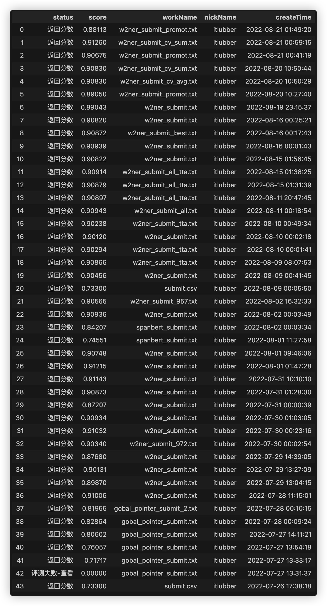

# 疫情新闻中的地理位置识别挑战赛

## 赛事任务
构建自然语言处理模型，对文本中的位置信息进行识别。

## 评审规则
预测测试集中的2600+数据中的位置信息进行识别，提取出相应的实体信息。评价标准采用`jaccard_score`指标。

---

## 解题思路

### 赛题理解
通过查看训练集数据中的标注数据，发现实体类别除位置信息外，还包公司名称和其他类别的实体，案例如下：

| **序号** | **新闻内容**                                  | **实体标注**     | **实体类型** |
|:------:|:-----------------------------------------:|:------------:|:--------:|
| 1      | 会安博物馆等，漫步会安古镇各精致的工艺品店、品尝路边的小吃摊，体验当地的风土民情。 | ['会安古镇']     | 景点       |
| 8      | 联达四方经纪公司总经理杨少峰                            | ['联达四方经纪公司'] | 公司名称     |
| 14     | 银行业协会今年理财产品销量将首破1万亿                       | ['银行业协会']    | 组织机构     |
| 371    | RTS星战之路首月将举行《魔兽争霸3》项目                     | ['RTS星战之路']  | 游戏       |
| ...    | ...    | ...  | ...  |


通过分析可以发现，实体类型不止包含地理位置信息，还包含公司名称、组织机构名称、游戏名称、人名等类别，故本题采用腾讯 [`UER-py`](https://github.com/dbiir/UER-py/wiki/%E9%A2%84%E8%AE%AD%E7%BB%83%E6%A8%A1%E5%9E%8B%E4%BB%93%E5%BA%93) 预训练模型仓库中的 [`uer/roberta-base-finetuned-cluener2020-chinese`](https://huggingface.co/uer/roberta-base-finetuned-cluener2020-chinese) 作为预训练模型，在此基础上微调可以很好的匹配当前任务。

[`uer/roberta-base-finetuned-cluener2020-chinese`](https://huggingface.co/uer/roberta-base-finetuned-cluener2020-chinese) 预训练模型为中文 `RoBERTa` 预训练模型在下游任务 [`CLUENER2020`](https://github.com/CLUEbenchmark/CLUENER2020) 上进行了微调得到的模型。


### 解题方案

本题在 [`ark-nlp`](https://github.com/xiangking/ark-nlp) 库中的 [`w2ner_bert`](https://github.com/xiangking/ark-nlp/tree/main/ark_nlp/model/ner/w2ner_bert) 代码的基础上，进行了部分小改动，使得模型能够直接加载 [`uer/roberta-base-finetuned-cluener2020-chinese`](https://huggingface.co/uer/roberta-base-finetuned-cluener2020-chinese) 预训练模型权重进行训练，并在训练过程中，加入对抗训练FGM，对模型中的 `word_embedding` 层的参数注入扰动，结合EMA策略，提高了模型的鲁棒性。

<!-- 同时，考虑到本次赛题数据集较少，且模型测试集上 `jaccard_score` 指标超过0.90，故使用了伪标签的方式扩充训练数据，并且在验证时依旧采用原有训练集中的数据来保证模型的准确性和泛化能力，有效的提高了模型的指标。 -->

前期把 [`ark-nlp`](https://github.com/xiangking/ark-nlp) 库中的 `ner` 方案基本都试了一遍，也实验了 [`bert4torch`](https://github.com/Tongjilibo/bert4torch) 里面的一些模型，比如 `UIE`， 也实验了下在文本首尾添加 `promot` 的方式，最终根据提交效果选择了最优的 `word2ner` 模型，同时对比了不同的预训练模型，包括 `nezha`、`roberta`、`bert` 以及其他在 `huggingface` 上的其他预训练模型，无论是 `base` 、 `large` 还是模型融合, 基本上都不如 [`uer/roberta-base-finetuned-cluener2020-chinese`](https://huggingface.co/uer/roberta-base-finetuned-cluener2020-chinese) 预训练模型微调直接预测结果好。

### 原始代码结构

```bash
.
├── requirements.txt                                        # 相关环境依赖
├── README.md                                               # 说明文档
├── code                        
│   ├── clear_cache.sh                                      # 清除代码运行过程中生成的 pyc、pyd文件
│   ├── additional.py                                       # 比赛页面显示的测试集前16条答案, 在推理时可以选择是否使用
│   ├── train.sh                                            # 模型训练脚本, cd ./code 后 chmod +x train.sh 再 ./train.sh
│   ├── test.sh                                             # 模型训练脚本, cd ./code 后 chmod +x test.sh 再 ./test.sh, 修改脚本中的 additional_tags 为 True 可使用页面上的标签
│   ├── ark_nlp                                             # ark_nlp 代码, 参考 https://github.com/xiangking/ark-nlp/tree/main/ark_nlp
│   │   ├── __init__.py
│   │   ├── dataset
│   │   ├── factory
│   │   ├── model                                           # 模型代码
│   │   ├── nn
│   │   └── processor
│   ├── test.py                                             # 推理代码
│   ├── test_pseudo.py                                         # 使用伪标签训练模型后的推理代码
│   ├── train_all.py                                        # 全量数据训练模型代码
│   └── train_all_pseudo.py                                    # 全量数据 + 伪标签 训练模型代码
├── prediction_result
├── user_data
│   ├── outputs                                             # 模型训练完保存的文件夹
│   ├── roberta-base-finetuned-cluener2020-chinese          # UER.py 提供的预训练模型
│   │   ├── config.json
│   │   ├── pytorch_model.bin
│   │   ├── special_tokens_map.json
│   │   ├── tokenizer_config.json
│   │   └── vocab.txt
│   ├── scores.jpg                                          # 比赛过程中提交结果的得分记录
│   └── 页面显示的测试集前16条答案.png
└── xfdata
    └── 疫情新闻中的地理位置信息识别挑战赛公开数据              # 比赛提供的数据集
        ├── sample_submit.csv
        ├── test.csv                                    # 测试集
        └── train.csv                                   # 训练集
```


### 代码运行


> 0. 代码运行环境: V100 24G
> 1. 安装相关环境依赖
> 2. 执行全量样本训练脚本: `train.sh`
> 3. 执行预测脚本: `test.sh`
> 4. 提交 `prediction_result` 目录下的 `result.csv` 作为最终的推理结果, `jaccard_score` 指标大致到 0.909左右
> 5. 如果使用网站页面上的测试集标签: 修改 `test.sh` 脚本中的加上 `--additional_tags` 选项, `jaccard_score` 指标大致可以提升4个千分点左右


<!-- > 1. 启动 `jupyter notebook` 或者 `jupyter lab` 服务
> 2. 运行 1.w2ner.ipynb，运行完成后生成 data/tta.csv 数据 和 w2ner_submit.txt 提交文件
> 3. 运行 2.w2ner_tta.ipynb，运行完成后生成 w2ner_submit_tta.txt 提交文件 和 新的 data/tta.csv 数据, 这一步可以循环运行多次, 缘分到了的话分数应该能到0.912 QaQ
> 4. 提交 w2ner_submit_tta.txt 作为最终的推理结果, `jaccard_score` 指标大致到 0.908左右 -->


> 提示说明: 最开始使用 `gobal_pointer` 跑出的 `tta.csv` 作为 `word2ner` 的训练数据的, 不加 trick 直接到了 `0.91`, 后期用 `word2ner` 跑 `tta.csv` 来的到的结果大部分时候都不如 `gobal_pointer` + `word2ner` 的结果，可能模型多样性也是一个比较好的上分点; 然后细心的话可以发现比赛页面有测试集前16条的答案，如果直接使用这部分答案的话，可以从 `0.91215` 涨到 `0.9126`


### 提交结果记录


